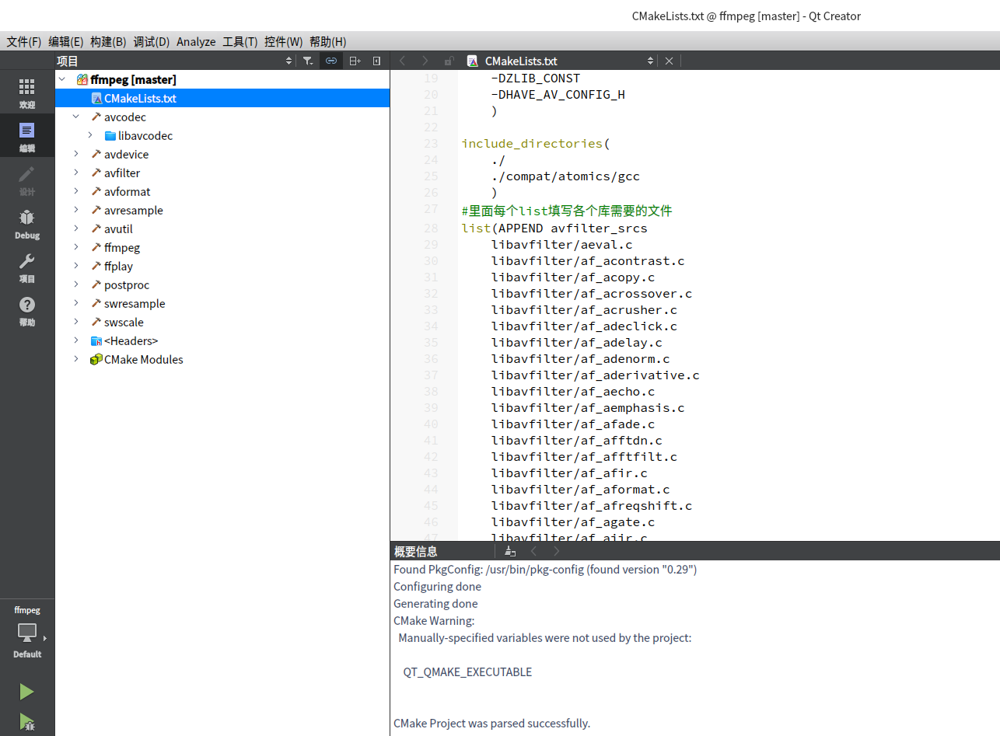

目前在uos/deepin操作系统试过（x86环境）

2021/3/30之前是编译不过，存在文件没有上传全面
当前31日之后文件上传完全了，即可使用cmake编译ffmpeg
在linux上 sudo apt build-dep ffmpeg

打开cmake工程，即可编译，可能环境跟随不同的电脑情况有变化，不过，都是小问题，可以解决，

这个是通过makefile和其他的信息自己写的cmake工程，放弃编译asm文件

如有问题,联系我:
liuminghang0821@qq.com

如果文件有没有上传完的，有个压缩包

